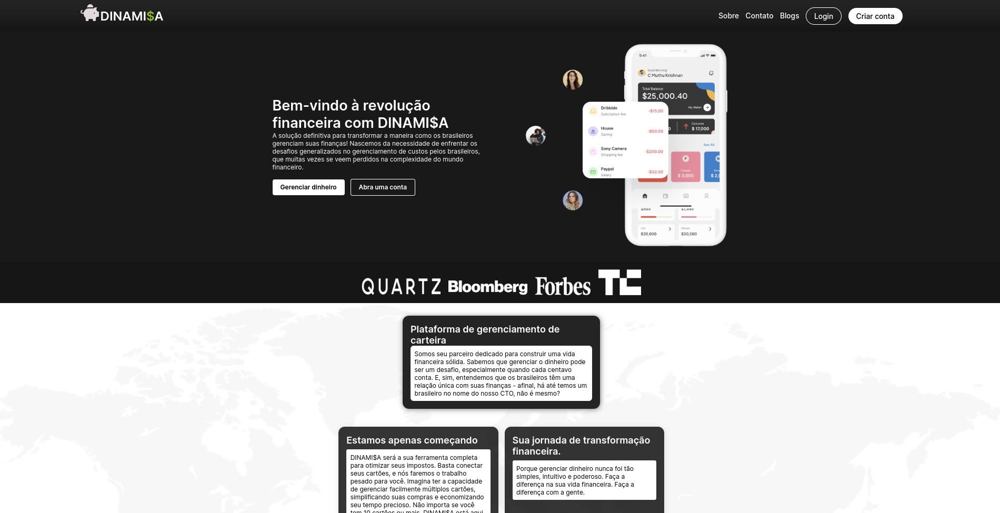
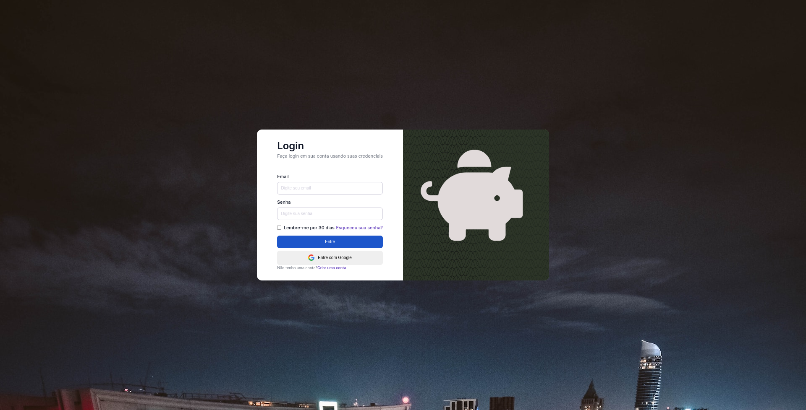
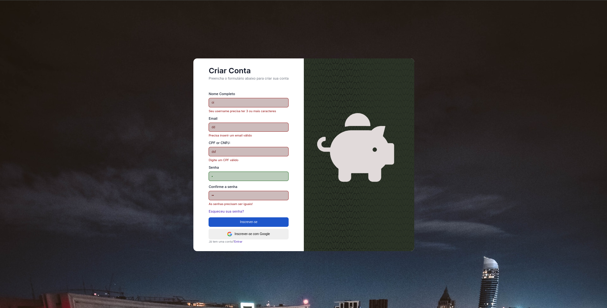
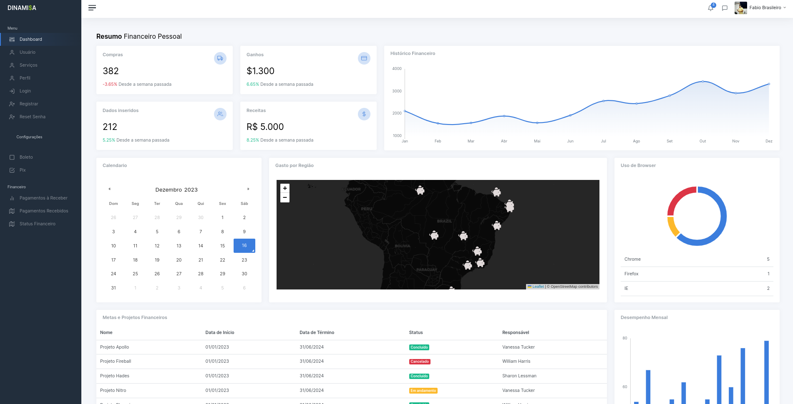
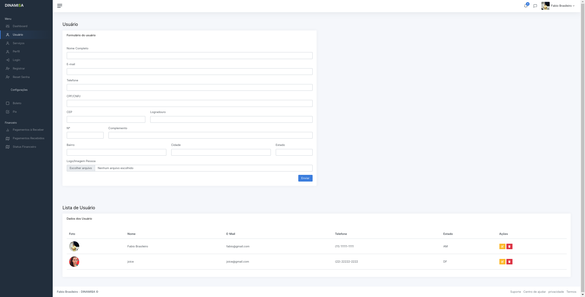
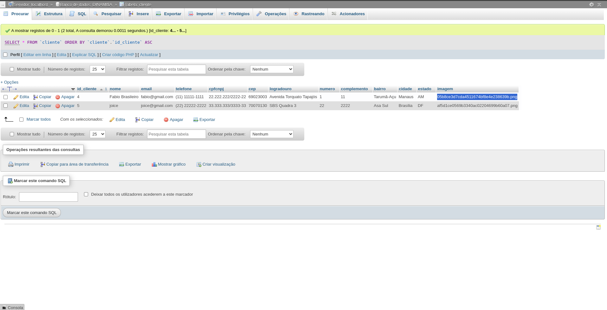

   

<h3 align="center">Proz | Projeto integrador</h3>

  Projeto desenvolvido durante as sprints do curso da Proz em parceria com a AWS

  
  
   

## Stack usadas

 

## Preview
DINAMI$A é um gerenciamento de dinheiro fácil e rápido. [Open demo](https://fintech-liard.vercel.app/Pages/).
 
<video>  <source src="video/Design sem nome(1).mp4'" type="video/mp4"></video>

